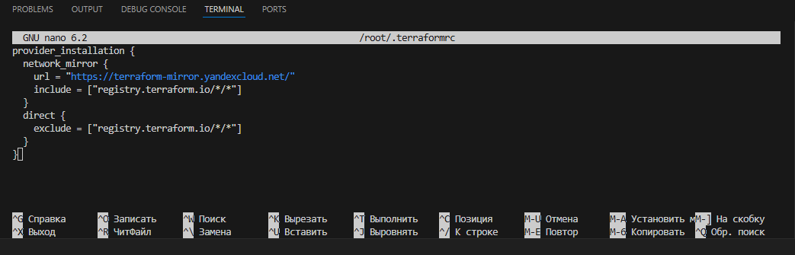
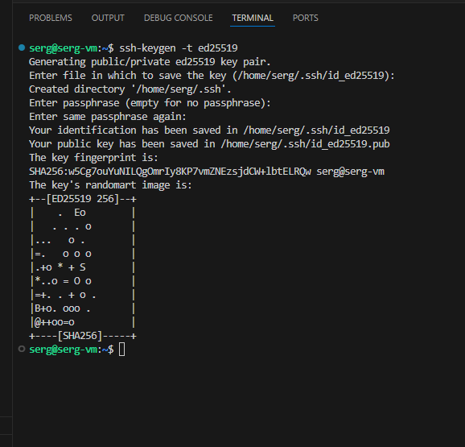
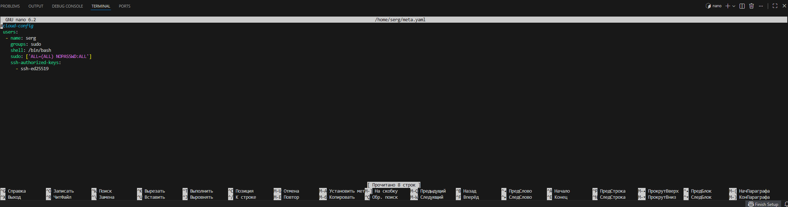
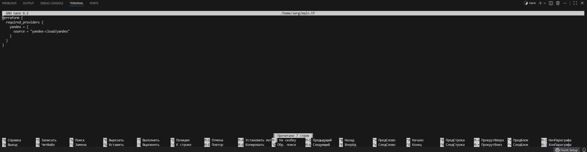
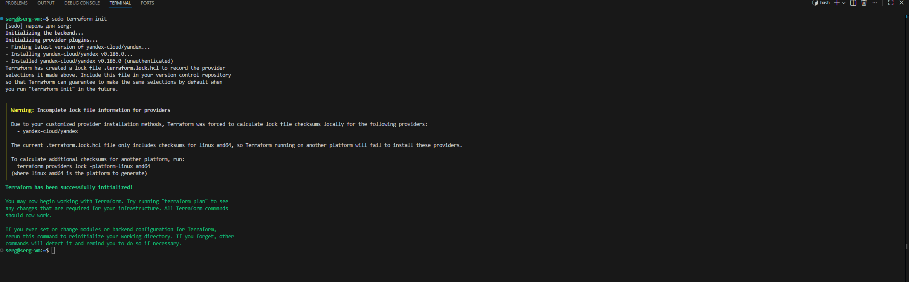
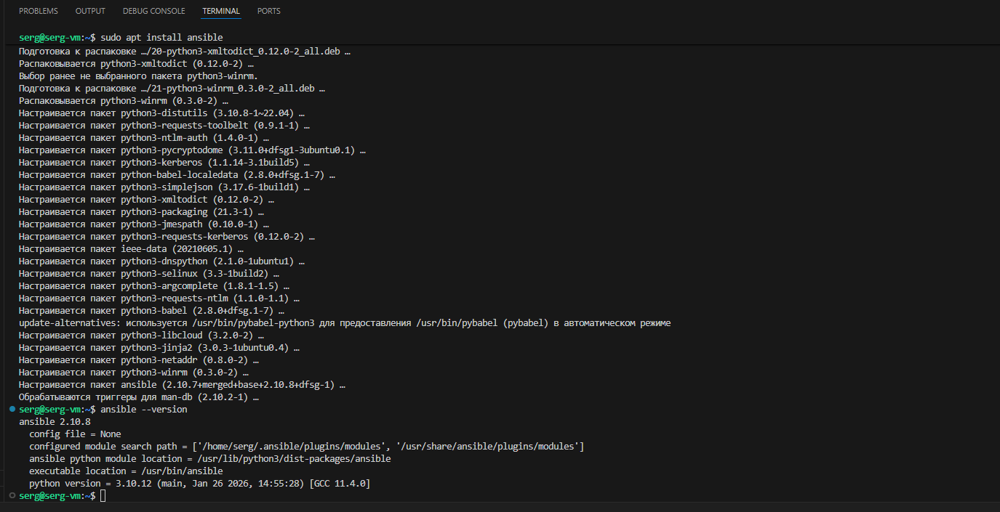

## 1.0 Установка и подготовка Terraform и Ansible.
### 1.1 Установка и подготовка Terraform.
Скачиваю и распаковываю стабильную версию с сайта: https://hashicorp-releases.yandexcloud.net/terraform/
```bash
wget https://hashicorp-releases.yandexcloud.net/terraform/1.13.3/terraform_1.13.3_linux_amd64.zip
unzip terraform_1.13.3_linux_amd64.zip
chmod 744 terraform
sudo cp terraform /usr/local/bin/
sudo terraform -version
```


Создаю файл `.terraformrc` и добавляю блок с источником, из которого будет устанавливаться провайдер.
```bash
nano ~/.terraformrc
```
```terraform
provider_installation {
  network_mirror {
    url = "https://terraform-mirror.yandexcloud.net/"
    include = ["registry.terraform.io/*/*"]
  }
  direct {
    exclude = ["registry.terraform.io/*/*"]
  }
}
```


Для файла с метаданными, `meta.yaml`, необходим публичный SSH-ключ для доступа к ВМ. Для Yandex Cloud рекомендуется использовать алгоритм Ed25519: сгенерированные по нему ключи — самые безопасные. Ссылка: https://cloud.yandex.ru/ru/docs/glossary/ssh-keygen
```bash
ssh-keygen -t ed25519
```


Создаю файл `meta.yaml` с данными пользователя на создаваемые ВМ.
```bash
nano ~/meta.yaml
```
```terraform
#cloud-config
 users:
  - name: serg
    groups: sudo
    shell: /bin/bash
    sudo: ['ALL=(ALL) NOPASSWD:ALL']
    ssh-authorized-keys:
      - ssh-ed25519
```

Создаю `playbook Terraform` c блоком провайдера.
```bash
nano ~/main.tf
```
```terraform
terraform {
  required_providers {
    yandex = {
      source = "yandex-cloud/yandex"
    }
  }
}
```

Инициализирую провайдера.
```bash
terraform-diplom init
```


#### Terraform готов к использованию. Продолжение в основной части.

---
### 1.2 Установка и подготовка Ansible.
Устанавливаю Ansible и проверяю версию.
```bash
sudo apt install ansible
ansible --version
```


Создаю полностью прокомментированный пример `ansible.cfg` и заменяю содержимое файла на необходимые опции. Файл прикреплю в основной части.
```bash
ansible-config init --disabled > ansible.cfg
nano ~/ansible.cfg
```

Создаю файл `hosts` и добавляю в него начальные данные. Файл прикреплю в основной части.

```bash
nano ~/hosts
```
#### Ansible готов к использованию. Продолжение в основной части.

[Ссылка на основную часть дипломной работы.](https://github.com/SergPonomarev76/diplom-sys45/blob/fed03283d2c8b382051f7ff96e8ccbafae5a434a/2.%20%D0%9E%D1%81%D0%BD%D0%BE%D0%B2%D0%BD%D0%B0%D1%8F%20%D1%87%D0%B0%D1%81%D1%82%D1%8C%20%D0%B4%D0%B8%D0%BF%D0%BB%D0%BE%D0%BC%D0%BD%D0%BE%D0%B9%20%D1%80%D0%B0%D0%B1%D0%BE%D1%82%D1%8B/README.md)
---