## 2.0 Основная часть дипломной работы. Этапы выполнения.
### 2.1 Заполнение конфигурационного файла terraform `main.tf` для выполнения задач дипломной работы.
Ссылки на файлы terraform: 

[main.tf](./files/main.tf)

[meta.yaml](./files/meta.yaml)

[terraformrc](./files/terraformrc)

#### По условиям задачи необходимо развернуть через terraform следующий ресурcы:

##### Сайт. Веб-сервера. Nginx.
- Создать две ВМ в разных зонах, установить на них сервер nginx.
- Создать Target Group, включить в неё две созданные ВМ.
- Создать Backend Group, настроить backends на target group, ранее созданную. Настроить healthcheck на корень (/) и порт 80, протокол HTTP.
- Создать HTTP router. Путь указать — /, backend group — созданную ранее.
- Создать Application load balancer для распределения трафика на веб-сервера, созданные ранее. Указать HTTP router, созданный ранее, задать listener тип auto, порт 80.
```terraform
####################
## Nginx-web-1 #####
####################
resource "yandex_compute_instance" "nginx-web-1" {
  name  = "nginx-web-1"
  hostname = "nginx-web-1"
  zone  = yandex_vpc_subnet.a-subnet-diplom.zone
  platform_id     = "standard-v3"
  resources {
    cores         = 2
    core_fraction = 20
    memory        = 2
  }

  boot_disk {
    initialize_params {
      image_id = "fd8k22q9mlprdarduk0o"
      size     = 10
    }
  }

  network_interface {
    subnet_id = "${yandex_vpc_subnet.a-subnet-diplom.id}"
    ipv4 = true
    ip_address = "192.168.10.3"
    security_group_ids = [yandex_vpc_security_group.bastion-security-local.id, yandex_vpc_security_group.nginx-web-security.id, yandex_vpc_security_group.filebeat-security.id]
  }

  metadata = {
    user-data = "${file("./meta.yaml")}"
  }
}

####################
## Nginx-web-2 #####
####################
resource "yandex_compute_instance" "nginx-web-2" {
  name  = "nginx-web-2"
  hostname = "nginx-web-2"
  zone  = yandex_vpc_subnet.b-subnet-diplom.zone
  platform_id     = "standard-v3"
  resources {
    cores         = 2
    core_fraction = 20
    memory        = 2
  }

  boot_disk {
    initialize_params {
      image_id = "fd8k22q9mlprdarduk0o"
      size     = 10
    }
  }

  network_interface {
    subnet_id = "${yandex_vpc_subnet.b-subnet-diplom.id}"
    ipv4 = true
    ip_address = "192.168.20.3"
    security_group_ids = [yandex_vpc_security_group.bastion-security-local.id, yandex_vpc_security_group.nginx-web-security.id, yandex_vpc_security_group.filebeat-security.id]
  }

  metadata = {
    user-data = "${file("./meta.yaml")}"
  }
}

#################################################################################################################
## Target group ##### https://cloud.yandex.ru/ru/docs/application-load-balancer/operations/target-group-create ##
#################################################################################################################
resource "yandex_alb_target_group" "nginx-target-group"{
  name = "nginx-target-group"

  target {
    subnet_id = "${yandex_vpc_subnet.a-subnet-diplom.id}"
    ip_address   = "${yandex_compute_instance.nginx-web-1.network_interface.0.ip_address}"
  } 

  target {
    subnet_id = "${yandex_vpc_subnet.b-subnet-diplom.id}"
    ip_address   = "${yandex_compute_instance.nginx-web-2.network_interface.0.ip_address}"
  }  
}

###################################################################################################################
## Backend group ##### https://cloud.yandex.ru/ru/docs/application-load-balancer/operations/backend-group-create ##
###################################################################################################################
resource "yandex_alb_backend_group" "nginx-backend-group" {
  name = "nginx-backend-group"
  session_affinity {
    connection {
      source_ip = false
    }
  }

  http_backend {
    name                   = "http-backend"
    weight                 = 1
    port                   = 80
    target_group_ids       = ["${yandex_alb_target_group.nginx-target-group.id}"]
    load_balancing_config {
      panic_threshold      = 90
    }    
    healthcheck {
      timeout              = "10s"
      interval             = "2s"
      healthy_threshold    = 10
      unhealthy_threshold  = 15 
      http_healthcheck {
        path               = "/"
      }
    }
  }
}

###############################################################################################################
## HTTP router ##### https://cloud.yandex.ru/ru/docs/application-load-balancer/operations/http-router-create ##
###############################################################################################################
resource "yandex_alb_http_router" "nginx-tf-router" {
  name   = "nginx-tf-router"
  labels = {
    tf-label    = "tf-label-value"
    empty-label = ""
  }
}

resource "yandex_alb_virtual_host" "nginx-virtual-host" {
  name           = "nginx-virtual-host"
  http_router_id = yandex_alb_http_router.nginx-tf-router.id
  route {
    name = "nginx-route"
    http_route {
      http_route_action {
        backend_group_id = yandex_alb_backend_group.nginx-backend-group.id
        timeout          = "60s"
      }
    }
  }
}    

############################################################################################################################################
## Application load balancer ##### https://cloud.yandex.com/ru/docs/application-load-balancer/operations/application-load-balancer-create ##
############################################################################################################################################
resource "yandex_alb_load_balancer" "nginx-balancer" {
  name        = "nginx-balancer"
  network_id  = "${yandex_vpc_network.network-diplom.id}"

  allocation_policy {
    location {
      zone_id   = "${yandex_vpc_subnet.d-subnet-diplom.zone}"
      subnet_id = yandex_vpc_subnet.d-subnet-diplom.id
    }
  }

  listener {
    name = "nginx-listener"
    endpoint {
      address {
        external_ipv4_address {
        }
      }
      ports = [ 80 ]
    }
    http {
      handler {
        http_router_id = yandex_alb_http_router.nginx-tf-router.id
      }
    }
  }
}
```

##### Мониторинг. Zabbix. Zabbix-agent.
- Создать ВМ, развернуть на ней Zabbix. На каждую ВМ установить Zabbix Agent, настроить агенты на отправление метрик в Zabbix.
```terraform
###############
## Zabbix #####
###############
resource "yandex_compute_instance" "zabbix" {
  name  = "zabbix"
  hostname = "zabbix"
  zone  = yandex_vpc_subnet.d-subnet-diplom.zone
  platform_id     = "standard-v3"
  resources {
    cores         = 2
    core_fraction = 20
    memory        = 2
  }

  boot_disk {
    initialize_params {
      image_id = "fd8k22q9mlprdarduk0o"
      size     = 10
    }
  }

  network_interface {
    subnet_id = "${yandex_vpc_subnet.d-subnet-diplom.id}"
    nat = true
    ipv4 = true
    ip_address = "192.168.30.4"
    security_group_ids = [yandex_vpc_security_group.bastion-security-local.id, yandex_vpc_security_group.zabbix-security.id]
  }

  metadata = {
    user-data = "${file("./meta.yaml")}"
  }
}
```

##### Логи. Elasticsearch. Kibana. Filebeat.
- Cоздать ВМ, развернуть на ней Elasticsearch. Установить Filebeat в ВМ к веб-серверам, настроить на отправку access.log, error.log nginx в Elasticsearch.
- Создать ВМ, развернуть на ней Kibana, сконфигурировать соединение с Elasticsearch.
```terraform
######################
## Elasticsearch #####
######################
resource "yandex_compute_instance" "elasticsearch" {
  name  = "elasticsearch"
  hostname = "elasticsearch"
  zone  = yandex_vpc_subnet.a-subnet-diplom.zone
  platform_id     = "standard-v3"
  resources {
    cores         = 2
    core_fraction = 20
    memory        = 4
  }

  boot_disk {
    initialize_params {
      image_id = "fd8k22q9mlprdarduk0o"
      size     = 10
    }
  }

  network_interface {
    subnet_id = "${yandex_vpc_subnet.a-subnet-diplom.id}"
    ipv4 = true
    ip_address = "192.168.10.4"
    security_group_ids = [yandex_vpc_security_group.bastion-security-local.id, yandex_vpc_security_group.elasticsearch-security.id, yandex_vpc_security_group.kibana-security.id, yandex_vpc_security_group.filebeat-security.id]
  }

  metadata = {
    user-data = "${file("./meta.yaml")}"
  }
}

###############
## Kibana #####
###############
resource "yandex_compute_instance" "kibana" {
  name  = "kibana"
  hostname = "kibana"
  zone  = yandex_vpc_subnet.d-subnet-diplom.zone
  platform_id     = "standard-v3"
  resources {
    cores         = 2
    core_fraction = 20
    memory        = 2
  }

  boot_disk {
    initialize_params {
      image_id = "fd8k22q9mlprdarduk0o"
      size     = 10
    }
  }

  network_interface {
    subnet_id = "${yandex_vpc_subnet.d-subnet-diplom.id}"
    nat = true
    ipv4 = true
    ip_address = "192.168.30.5"
    security_group_ids = [yandex_vpc_security_group.bastion-security-local.id, yandex_vpc_security_group.elasticsearch-security.id, yandex_vpc_security_group.kibana-security.id, yandex_vpc_security_group.filebeat-security.id]
  }

  metadata = {
    user-data = "${file("./meta.yaml")}"
  }
}
```
##### Сеть.
- Развернуть один VPC.
- Сервера web, Elasticsearch поместить в приватные подсети. 
- Сервера Zabbix, Kibana, application load balancer определить в публичную подсеть.
- Настроить Security Groups соответствующих сервисов на входящий трафик только к нужным портам.
- Настроить ВМ с публичным адресом, в которой будет открыт только один порт — ssh. Эта вм будет реализовывать концепцию bastion host.
```terraform
#################################################################################
## Network ##### https://cloud.yandex.ru/ru/docs/vpc/operations/network-create ##
#################################################################################
resource "yandex_vpc_network" "network-diplom" {
  name        = "network-diplom"
  description = "Network diplom"
}

###########################################################################################################
## Subnet. Gateway. Route table ###### https://cloud.yandex.ru/ru/docs/vpc/operations/create-nat-gateway ##
###########################################################################################################
resource "yandex_vpc_subnet" "a-subnet-diplom" {
  name           = "a-subnet-diplom"
  v4_cidr_blocks = ["192.168.10.0/24"]
  zone           = "ru-central1-a"
  network_id     = yandex_vpc_network.network-diplom.id
  route_table_id = yandex_vpc_route_table.a-b-subnet-route-table.id
}

resource "yandex_vpc_subnet" "b-subnet-diplom" {
  name           = "b-subnet-diplom"
  v4_cidr_blocks = ["192.168.20.0/24"]
  zone           = "ru-central1-b"
  network_id     = yandex_vpc_network.network-diplom.id
  route_table_id = yandex_vpc_route_table.a-b-subnet-route-table.id
}

resource "yandex_vpc_subnet" "d-subnet-diplom" {
  name           = "d-subnet-diplom"
  v4_cidr_blocks = ["192.168.30.0/24"]
  zone           = "ru-central1-d"
  network_id     = yandex_vpc_network.network-diplom.id
}

resource "yandex_vpc_gateway" "gateway-route-table" {
  name = "gateway-route-table"
  shared_egress_gateway {}
}

resource "yandex_vpc_route_table" "a-b-subnet-route-table" {
  name           = "a-b-subnet-route-table"
  network_id     = yandex_vpc_network.network-diplom.id

  static_route {
    destination_prefix = "0.0.0.0/0"
    gateway_id         = yandex_vpc_gateway.gateway-route-table.id
  }
}

########################################################################################
## Security_groups ##### https://cloud.yandex.ru/ru/docs/vpc/concepts/security-groups ##
########################################################################################
resource "yandex_vpc_security_group" "bastion-security-local" {
  name        = "bastion-security-local"
  description = "Bastion security for local ip"
  network_id  = yandex_vpc_network.network-diplom.id

  ingress {
    protocol       = "TCP"
    description    = "IN to 22 port from local ip"
    v4_cidr_blocks = ["192.168.10.0/24", "192.168.20.0/24", "192.168.30.0/24"]
    port           = 22
  }

  egress {
    protocol       = "TCP"
    description    = "OUT from 22 port to local ip"
    v4_cidr_blocks = ["192.168.10.0/24", "192.168.20.0/24", "192.168.30.0/24"]
    port           = 22
  } 

  egress {
    protocol       = "ANY"
    description    = "OUT from any ip"
    v4_cidr_blocks = ["0.0.0.0/0"]
    from_port      = 0
    to_port        = 65535
  }
}

resource "yandex_vpc_security_group" "bastion-security" {
  name        = "bastion-security"
  description = "Bastion security to connect to bastion"
  network_id  = yandex_vpc_network.network-diplom.id

  ingress {
    protocol          = "TCP"
    description       = "IN to 22 port from any ip"
    v4_cidr_blocks    = ["0.0.0.0/0"]
    port              = 22
  }

  egress {
    protocol          = "ANY"
    description       = "OUT from any ip"
    v4_cidr_blocks    = ["0.0.0.0/0"]
    from_port         = 0
    to_port           = 65535
  }  

  ingress {
    protocol          = "TCP"
    description       = "IN to 22 port from local ip"
    security_group_id = yandex_vpc_security_group.bastion-security-local.id
    port              = 22
  }

  egress {
    protocol          = "TCP"
    description       = "OUT from 22 port to local ip"
    security_group_id = yandex_vpc_security_group.bastion-security-local.id
    port              = 22
  }
}

resource "yandex_vpc_security_group" "nginx-web-security" {
  name        = "nginx-web-security"
  description = "Nginx-web security"
  network_id  = yandex_vpc_network.network-diplom.id

  ingress {
    protocol       = "ANY"
    description    = "IN to 80 port from any ip"
    v4_cidr_blocks = ["0.0.0.0/0"]
    port           = 80
  }

  egress {
    protocol       = "ANY"
    description    = "OUT from 80 port to any ip"
    v4_cidr_blocks = ["0.0.0.0/0"]
    port           = 80
  }

  ingress {
    protocol       = "ANY"
    description    = "IN to 10050 port from any ip"
    v4_cidr_blocks = ["0.0.0.0/0"]
    port           = 10050
  }

  egress {
    protocol       = "ANY"
    description    = "OUT from 10050 port to any ip"
    v4_cidr_blocks = ["0.0.0.0/0"]
    port           = 10050
  }
}

resource "yandex_vpc_security_group" "zabbix-security" {
  name        = "zabbix-security"
  description = "Zabbix security"
  network_id  = yandex_vpc_network.network-diplom.id

  ingress {
    protocol       = "TCP"
    description    = "IN to 80 port from any ip"
    v4_cidr_blocks = ["0.0.0.0/0"]
    port           = 80
  }

  egress {
    protocol       = "TCP"
    description    = "OUT from 80 port to any ip"
    v4_cidr_blocks = ["0.0.0.0/0"]
    port           = 80
  }

  ingress {
    protocol       = "TCP"
    description    = "IN to 10051 from local ip"
    v4_cidr_blocks = ["192.168.10.0/24","192.168.20.0/24","192.168.30.0/24"]
    port           = 10051
  }

    egress {
    protocol       = "TCP"
    description    = "OUT from 10051 port to local ip"
    v4_cidr_blocks = ["192.168.10.0/24","192.168.20.0/24","192.168.30.0/24"]
    port           = 10051
  }
}

resource "yandex_vpc_security_group" "elasticsearch-security" {
  name        = "elasticsearch-security"
  description = "Elasticsearch security"
  network_id  = yandex_vpc_network.network-diplom.id

  ingress {
    protocol       = "TCP"
    description    = "IN to 9200 port from local ip"
    v4_cidr_blocks = ["192.168.10.0/24","192.168.20.0/24","192.168.30.0/24"]
    port           = 9200
  }

  egress {
    protocol       = "TCP"
    description    = "OUT from 9200 port to local ip"
    v4_cidr_blocks = ["192.168.10.0/24","192.168.20.0/24","192.168.30.0/24"]
    port           = 9200
  }

  ingress {
    protocol       = "ANY"
    description    = "IN to 10050 port from any ip"
    v4_cidr_blocks = ["0.0.0.0/0"]
    port           = 10050
  }

  egress {
    protocol       = "ANY"
    description    = "OUT from 10050 port to any ip"
    v4_cidr_blocks = ["0.0.0.0/0"]
    port           = 10050
  }
}

resource "yandex_vpc_security_group" "kibana-security" {
  name        = "kibana-security"
  description = "Kibana security"
  network_id  = yandex_vpc_network.network-diplom.id

  ingress {
    protocol       = "ANY"
    description    = "IN to 10050 port from any ip"
    v4_cidr_blocks = ["0.0.0.0/0"]
    port           = 10050
  }

  egress {
    protocol       = "ANY"
    description    = "OUT from 10050 to any ip"
    v4_cidr_blocks = ["0.0.0.0/0"]
    port           = 10050
  }

  ingress {
    protocol       = "TCP"
    description    = "IN to 5601 port from any ip"
    v4_cidr_blocks = ["0.0.0.0/0"]
    port           = 5601
  }

  egress {
    protocol       = "TCP"
    description    = "OUT from 5601 to any ip"
    v4_cidr_blocks = ["0.0.0.0/0"]
    port           = 5601
  }
}

resource "yandex_vpc_security_group" "filebeat-security" {
  name        = "filebeat-security"
  description = "Filebeat security"
  network_id  = yandex_vpc_network.network-diplom.id

  ingress {
    protocol       = "TCP"
    description    = "IN to 5044 port from local ip"
    v4_cidr_blocks = ["192.168.10.0/24","192.168.20.0/24","192.168.30.0/24"]
    port           = 5044
  }

  egress {
    protocol       = "TCP"
    description    = "OUT from 5044 to local ip"
    v4_cidr_blocks = ["192.168.10.0/24","192.168.20.0/24","192.168.30.0/24"]
    port           = 5044
  }
}

################
## Bastion #####
################
resource "yandex_compute_instance" "bastion" {
  name  = "bastion"
  hostname = "bastion"
  zone  = yandex_vpc_subnet.d-subnet-diplom.zone
  platform_id     = "standard-v3"
  resources {
    cores         = 2
    core_fraction = 20
    memory        = 2
  }

  boot_disk {
    initialize_params {
      image_id = "fd8k22q9mlprdarduk0o"
      size     = 10
    }
  }

  network_interface {
    subnet_id = "${yandex_vpc_subnet.d-subnet-diplom.id}"
    nat = true
    ipv4 = true
    ip_address = "192.168.30.3"
    security_group_ids = [yandex_vpc_security_group.bastion-security.id]
  }

  metadata = {
    user-data = "${file("./meta.yaml")}"
  }
}
```
##### Резервное копирование.
- Создать snapshot дисков всех ВМ. 
- Ограничить время жизни snaphot в неделю. 
- Сами snaphot настроить на ежедневное копирование.
```terraform
#################################################################################################################
## Snapshot_schedule ##### https://cloud.yandex.ru/ru/docs/compute/operations/snapshot-control/create-schedule ##
#################################################################################################################
resource "yandex_compute_snapshot_schedule" "snapshot-diplom" {
  name = "snapshot-diplom"

  schedule_policy {
    expression = "30 1 * * *"
  }

  snapshot_count = 7

  snapshot_spec {
      description = "Snapshots. Every day at 01:30"
  }

  disk_ids = ["${yandex_compute_instance.bastion.boot_disk.0.disk_id}", "${yandex_compute_instance.nginx-web-1.boot_disk.0.disk_id}", "${yandex_compute_instance.nginx-web-2.boot_disk.0.disk_id}", "${yandex_compute_instance.zabbix.boot_disk.0.disk_id}", "${yandex_compute_instance.elasticsearch.boot_disk.0.disk_id}", "${yandex_compute_instance.kibana.boot_disk.0.disk_id}"]
}
```
---

### 2.2 Запуск terraform playbook.
```bash
terraform-diplom apply
```
---

### 2.3 Проверка развернутых ресурсов в Yandex Cloud.
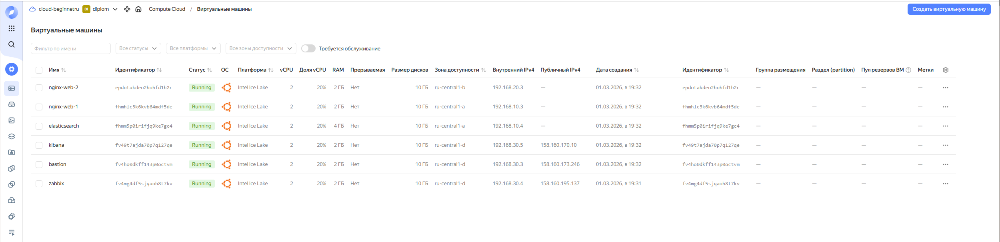
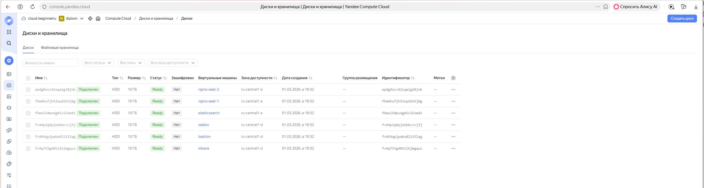
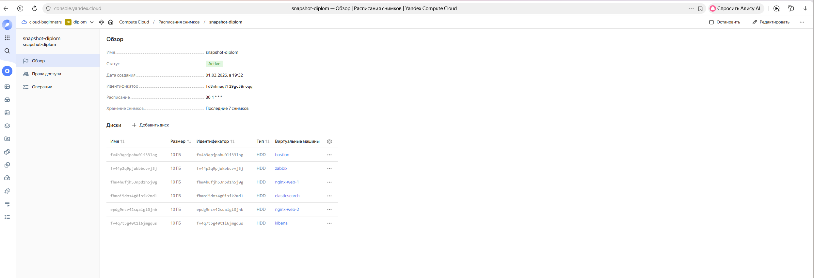
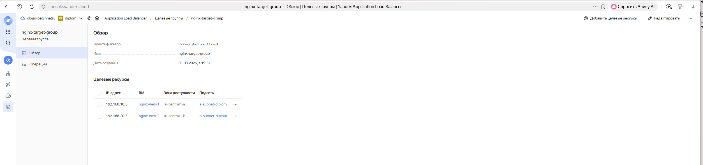
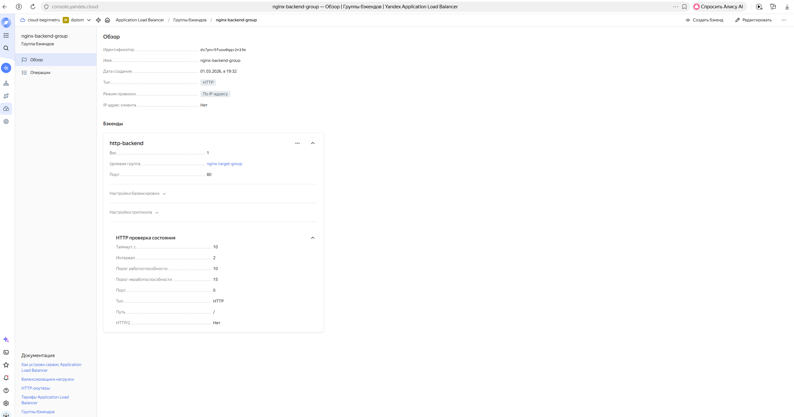
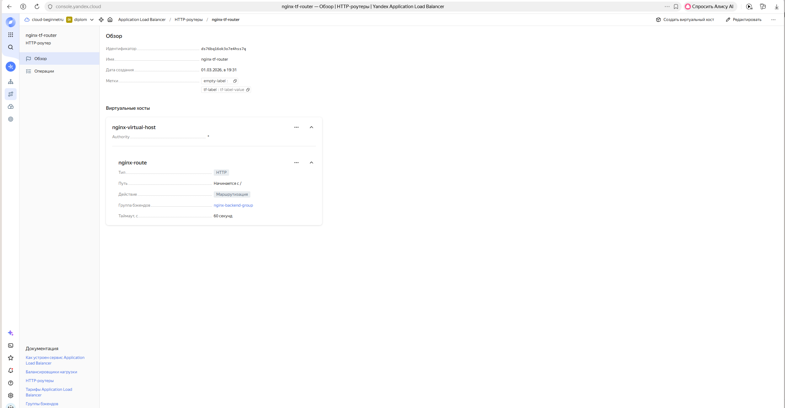
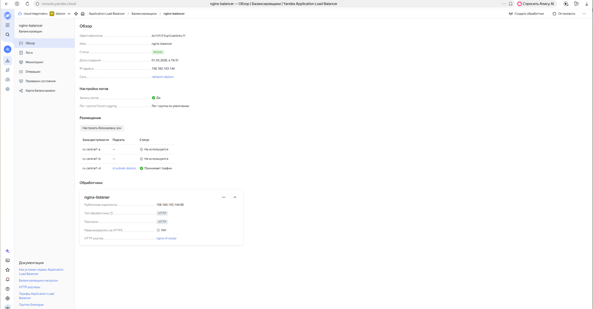
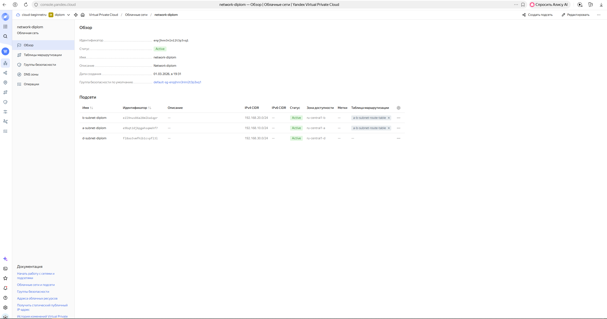
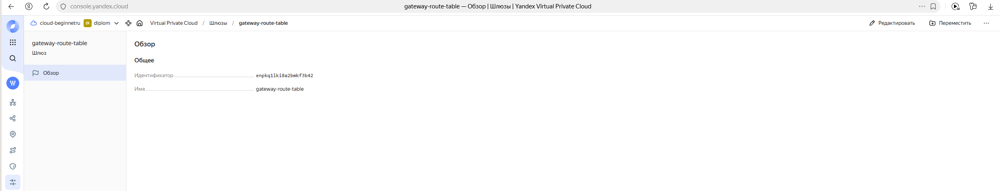
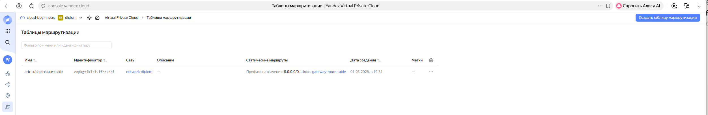
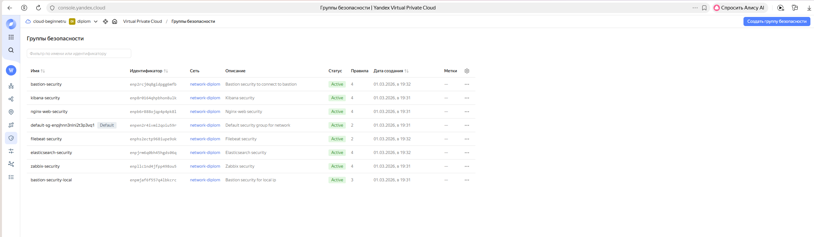
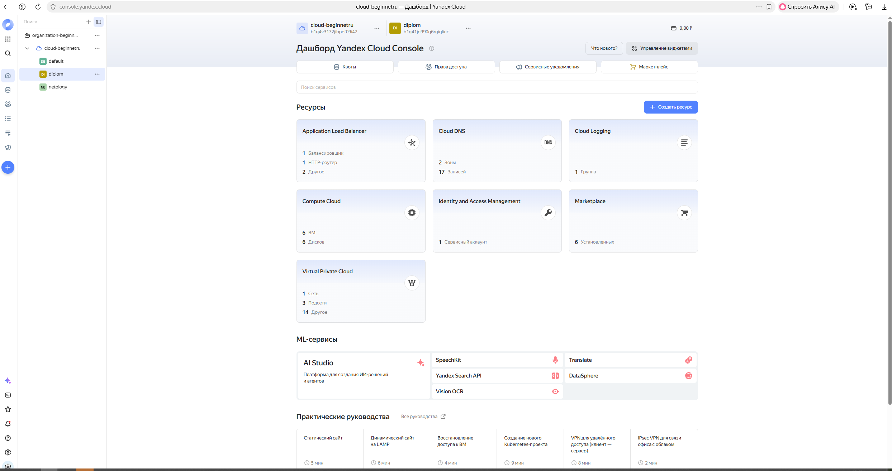
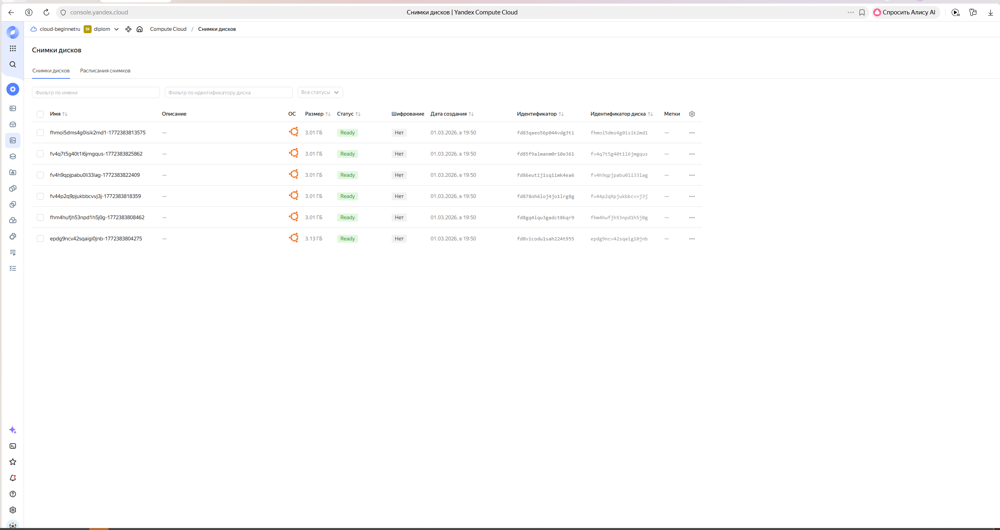

#### Все ресурсы через terraform развернуты и работают. 

---
### 2.4 Заполнение конфигурационного файла ansible `ansible.cfg` и inventory `hosts` для выполнения задач дипломной работы.

Ссылки на файлы ansible: 

[ansible.cfg](files/ansible.cfg)

[hosts](files/hosts)

##### `ansible.cfg`. Раскоментировал и заполнил следующие строки.
```ansible
inventory         =/home/serg/hosts
host_key_checking = False
remote_user       = serg
private_key_file  = ~/.ssh/id_ed25519
become            =True
```
##### `hosts`. Настроил подключение к ресурсам через ProxyCommand.
```ansible
[nginx-web]
nginx-web-1
nginx-web-2

[zabbix]
zabbix

[elasticsearch]
elasticsearch

[kibana]
kibana

[nginx-web:vars]
ansible_ssh_common_args='-o ProxyCommand="ssh -W %h:%p -q serg@158.160.173.246"'

[zabbix:vars]
ansible_ssh_common_args='-o ProxyCommand="ssh -W %h:%p -q serg@158.160.173.246"'

[elasticsearch:vars]
ansible_ssh_common_args='-o ProxyCommand="ssh -W %h:%p -q serg@158.160.173.246"'

[kibana:vars]
ansible_ssh_common_args='-o ProxyCommand="ssh -W %h:%p -q serg@158.160.173.246"'
```

---
### 2.5 Ansible-playbooks для установки и конфигурирования необходимых сервисов.

Ссылки на файлы ansible-playbook:

[playbook-nginx-web.yaml](files/playbook-nginx-web.yaml)

[playbook-zabbix.yaml](files/playbook-zabbix.yaml)

[playbook-zabbix-agent.yaml](files/playbook-zabbix-agent.yaml)

[playbook-elasticsearch.yaml](files/files%20ansible/playbook-elasticsearch.yaml)

[playbook-kibana.yaml](files/playbook-kibana.yaml)

[playbook-filebeat.yaml](files/playbook-filebeat.yaml)

[playbook-filebeat2.yaml](files/playbook-filebeat2.yaml)

Ссылка на файл с сайтом: 

[index.nginx-debian.html](files/index.nginx-ubuntu.html)

Ссылки на конфигурационные файлы: 

[elasticsearch.yml](files/elasticsearch.yml)

[kibana.yml](files/kibana.yml)

[filebeat.yml](files/filebeat.yml)

[filebeat2.yml](files/filebeat2.yml)

##### Сайт. Веб-сервера. Nginx.
  
Устанавливаю сервер nginx на 2 ВМ. Заменяю стандартный файл `index.nginx-debian.html`
```ansible
---
- name: "install nginx --> replacing a file index.nginx-debian.html --> restart nginx"
  hosts: nginx-web
  become: true

  tasks:
  - name: "1/4 apt update"
    apt:
      update_cache: yes

  - name: "2/4 install nginx"
    apt:
      name: nginx
      state: latest

  - name: "3/4 replacing a file 'index.nginx-debian.html' for nginx-web"
    copy:
      src: /root/index.nginx-debian.html
      dest: /var/www/html/index.html

  - name: "4/4 restart Nginx"
    systemd:
      name: nginx
      state: restarted
```
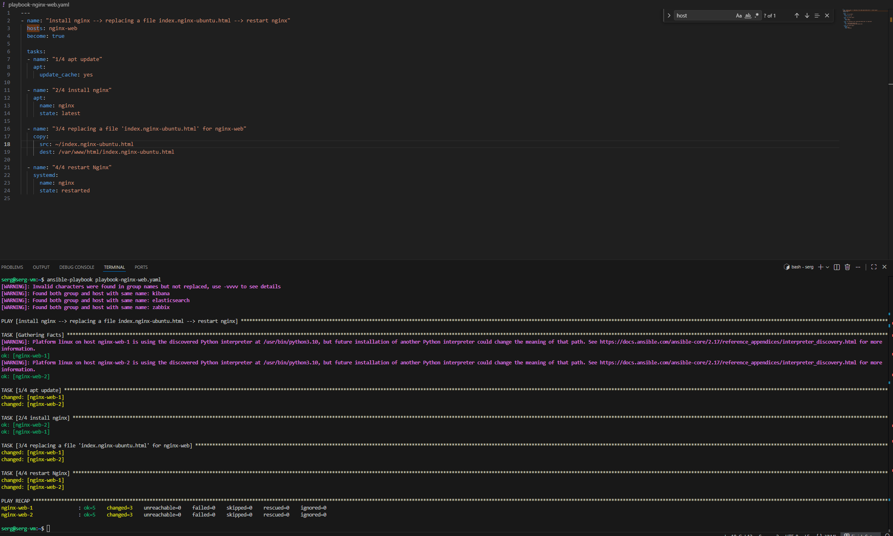

##### Мониторинг. Zabbix. Zabbix-agent.

Разворачиваю Zabbix.
```ansible
---
- name: "download and install zabbix"
  hosts: zabbix
  become: true

  tasks:
  - name: "1/8 apt update"
    apt:
      update_cache: yes

  - name: "2/8 install  postgresql"
    apt:
      name: postgresql
      state: latest

  - name: "3/8 download zabbix"
    get_url:
      url: https://repo.zabbix.com/zabbix/7.0/ubuntu/pool/main/z/zabbix-release/zabbix-release_latest_7.0+ubuntu22.04_all.deb
      dest: "/home/serg"

  - name: "4/8 dpkg -i zabbix"
    apt:
      deb: /home/serg/zabbix-release_latest_7.0+ubuntu22.04_all.deb


  - name: "5/8 apt update"
    apt:
      update_cache: yes

  - name: "6/8 install zabbix-server-pgsql, zabbix-frontend-php, php8.1-pgsql, zabbix-apache-conf, zabbix-sql-scripts, zabbix-agent"
    apt:
      name:
      - zabbix-server-pgsql
      - zabbix-frontend-php
      - php8.1-pgsql
      - zabbix-apache-conf
      - zabbix-sql-scripts
      - zabbix-agent
      state: present

  - name: "7/8 create user and database zabbix, import initial schema and data, configure DBPassword"
    shell: |
      su - postgres -c 'psql --command "CREATE USER zabbix WITH PASSWORD '\'123456789\'';"'
      su - postgres -c 'psql --command "CREATE DATABASE zabbix OWNER zabbix;"'
      zcat /usr/share/zabbix-sql-scripts/postgresql/server.sql.gz | sudo -u zabbix psql zabbix
      sed -i 's/# DBPassword=/DBPassword=123456789/g' /etc/zabbix/zabbix_server.conf

  - name: "8/8 restart and enable zabbix-server and apache"
    shell: |
      systemctl restart zabbix-server apache2
      systemctl enable zabbix-server apache2
```
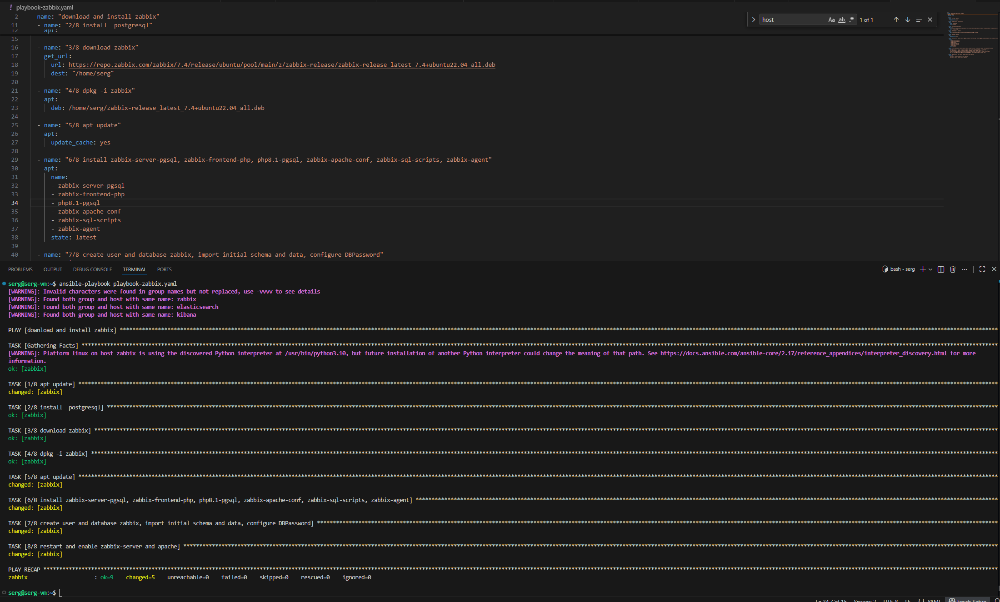

На каждую ВМ устанавливаю Zabbix Agent, настраиваю агенты на отправление метрик в Zabbix.

```ansible
---
- name: "download and install zabbix-agent"
  hosts: all
  become: true

  tasks:
  - name: "1/7 apt update"
    apt:
      upgrade: yes
      update_cache: yes

  - name: "2/7 download zabbix-agent"
    get_url:
      url: https://repo.zabbix.com/zabbix/7.0/ubuntu/pool/main/z/zabbix-release/zabbix-release_latest_7.0+ubuntu22.04_all.deb
      dest: "/home/serg"

  - name: "3/7 dpkg -i zabbix-agent"
    apt:
      deb: /home/serg/zabbix-release_latest_7.0+ubuntu22.04_all.deb

  - name: "4/7 apt update"
    apt:
      update_cache: yes

  - name: "5/7 apt install zabbix-agent"
    apt:
      name: zabbix-agent

  - name: "6/7 ip replacement in zabbix_agentd.conf"
    shell: |
      sed -i 's/Server=127.0.0.1/Server=192.168.30.4/g' /etc/zabbix/zabbix_agentd.conf

  - name: "7/7 restart and enable zabbix-agent"
    shell: |
      systemctl restart zabbix-agent
      systemctl enable zabbix-agent
```
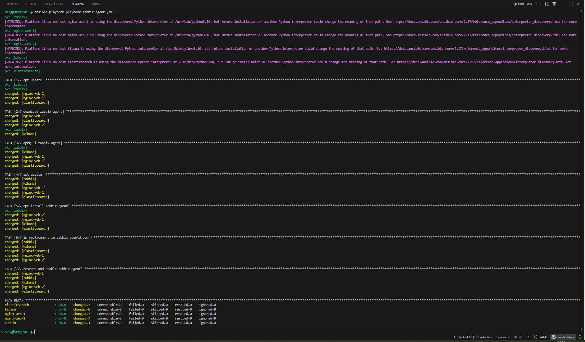

##### Логи. Elasticsearch. Kibana. Filebeat.

Разворачиваю на ВМ Elasticsearch.
```ansible
---
- name: "download and install elasticsearch"
  hosts: elasticsearch
  become: true

  tasks:
  - name: "1/5 install gnupg and apt-transport-https"
    apt:
      name:
      - gnupg
      - apt-transport-https
      state: present

  - name: "2/5 download elasticsearch"
    get_url:
      url: https://mirror.yandex.ru/mirrors/elastic/7/pool/main/e/elasticsearch/elasticsearch-7.17.9-amd64.deb
      dest: "/home/serg"

  - name: "3/5 dpkg -i elasticsearch"
    apt:
      deb: /home/serg/elasticsearch-7.17.9-amd64.deb

  - name: "4/5 elasticsearch configuration 'elasticsearch.yml'"
    copy:
      src: ~/elasticsearch.yml
      dest: /etc/elasticsearch/elasticsearch.yml

  - name: "5/5 enable and start elasticsearch"
    shell: |
      systemctl daemon-reload
      systemctl enable elasticsearch.service
      systemctl start elasticsearch.service
```

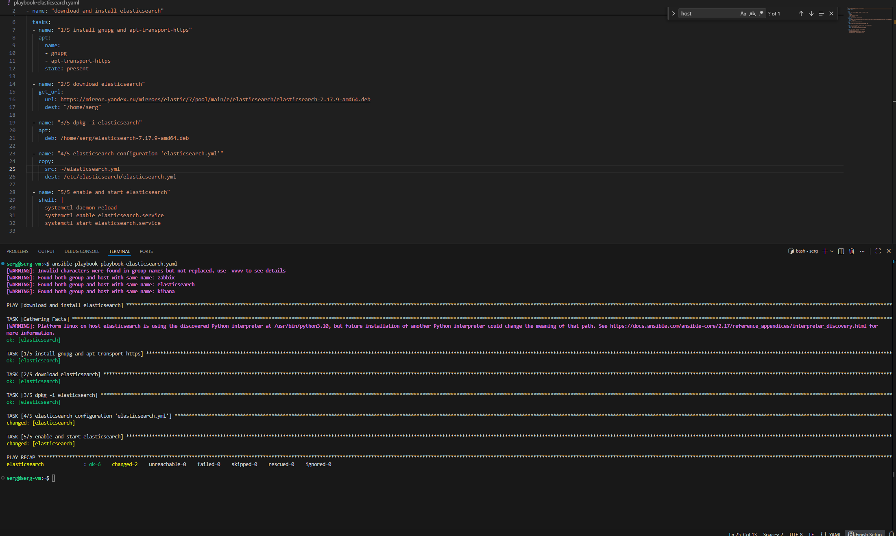 

Разворачиваю на другой ВМ Kibana, конфигурирую соединение с Elasticsearch и добавляю параметр `server.publicBaseUrl: "http://158.160.170.10:5601"` в конфигурационный файл `kibana.yml` 

```ansible
---
- name: "download and install kibana"
  hosts: kibana
  become: true

  tasks:
  - name: "1/5 install gnupg and apt-transport-https"
    apt:
      name:
      - gnupg
      - apt-transport-https
      state: present

  - name: "2/5 download kibana"
    get_url:
      url: https://mirror.yandex.ru/mirrors/elastic/7/pool/main/k/kibana/kibana-7.17.9-amd64.deb
      dest: "/home/serg"

  - name: "3/5 dpkg -i kibana"
    apt:
      deb: /home/serg/kibana-7.17.9-amd64.deb

  - name: "4/5 kibana configuration 'kibana.yml'"
    copy:
      src: ~/kibana.yml
      dest: /etc/kibana/kibana.yml

  - name: "5/5 enable and start kibana"
    shell: |
      systemctl daemon-reload
      systemctl enable kibana.service
      systemctl start kibana.service
```
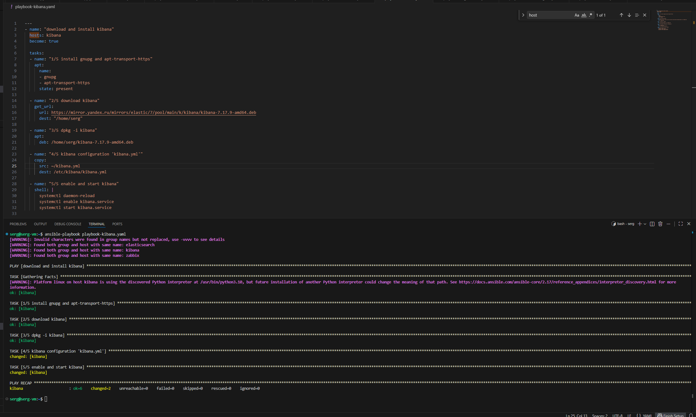

Устанавливаю Filebeat в ВМ к веб-серверам, настраиваю на отправку access.log, error.log nginx в Elasticsearch.

```ansible
---
- name: "download and install filebeat for nginx-web-1"
  hosts: nginx-web-1
  become: true

  tasks:
  - name: "1/5 install gnupg and apt-transport-https"
    apt:
      name:
      - gnupg
      - apt-transport-https
      state: present

  - name: "2/5 download filebeat"
    get_url:
      url: https://mirror.yandex.ru/mirrors/elastic/7/pool/main/f/filebeat/filebeat-7.17.9-amd64.deb
      dest: "/home/serg"

  - name: "3/5 dpkg -i filebeat"
    apt:
      deb: /home/serg/filebeat-7.17.9-amd64.deb

  - name: "4/5 copy config file for filebeat"
    copy:
      src: ~/filebeat.yml
      dest: /etc/filebeat/

  - name: "5/5 enable and start filebeat"
    shell: |
      systemctl deamon-reload
      systemctl enable filebeat.service
      systemctl start filebeat.service

```
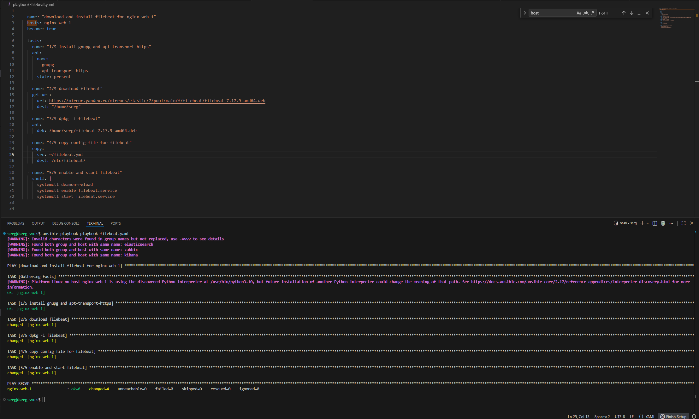
```ansible
---
- name: "download and install filebeat for nginx-web-2"
  hosts: nginx-web-2
  become: true

  tasks:
  - name: "1/5 install gnupg and apt-transport-https"
    apt:
      name:
      - gnupg
      - apt-transport-https
      state: present

  - name: "2/5 download filebeat"
    get_url:
      url: https://mirror.yandex.ru/mirrors/elastic/7/pool/main/f/filebeat/filebeat-7.17.9-amd64.deb
      dest: "/home/serg"

  - name: "3/5 dpkg -i filebeat"
    apt:
      deb: /home/serg/filebeat-7.17.9-amd64.deb

  - name: "4/5 copy config file for filebeat"
    copy:
      src: ~/filebeat2.yml
      dest: /etc/filebeat/filebeat.yml

  - name: "5/5 enable and start filebeat"
    shell: |
      systemctl deamon-reload
      systemctl enable filebeat.service
      systemctl start filebeat.service
```


#### Все сервисы через ansible развернуты.

---

### 2.6 Проверка и настройка ресурсов для выполнения задач дипломной работы.

##### Сайт.
Протестирую работу сайта с ip балансировщика.
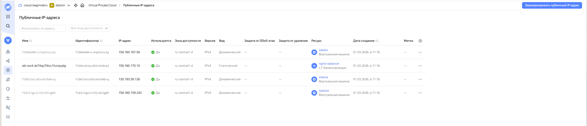
```bash
curl -v 158.160.143.144:80
```
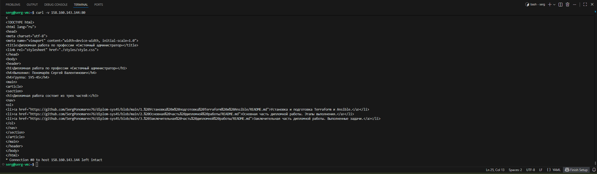

Этот же сайт с браузера.


##### Мониторинг.
Проверка работы Zabbix. Перехожу на страницу с Zabbix `http://158.160.195.137/zabbix`.


Логин: Admin

Пароль: zabbix


Создаю Template, а точнее редактирую наиболее подходящий, с необходимыми метриками.


Добавляю сервера.


Настраиваю дешборды с отображением метрик, c минимальным набором 


##### Логи.
Захожу в kibana `http://158.160.170.10:5601/`


Создаю Index patterns.


Логи отправляются.


##### Резервное копирование.
Резервное копирование настроено на 1:30.


[Ссылка на заключительную часть дипломной работы.](https://github.com/SergPonomarev76/diplom-sys45/blob/main/3.%20Заключительная%20часть%20дипломной%20работы/README.md)
---